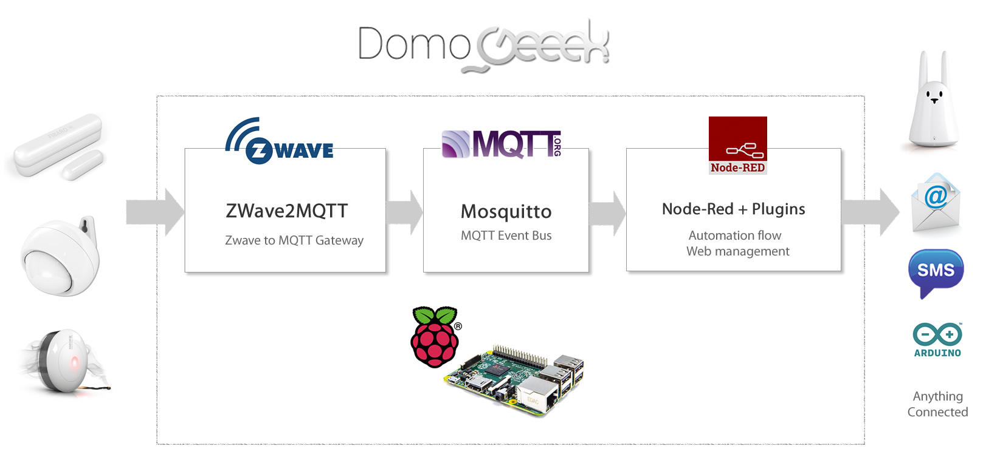

DomoGeeek is an OpenSource home automation solution running on a Raspberry Pi and based on Node-RED.


Preinstalled Node-Red modules for home-automation : 
* Scheduler : Schedule tasks at fixed time or sun time.
* MongoDB : MongoDB connector for saving data.

This project works perfectly with the [ZWave2MQTT](https://github.com/ltoinel/ZWave2MQTT) module for interaction with Z-Wave devices throw an MQTT bus.



----
#Tutorial

## Prerequisites 
* [Install Node v0.12 on your Raspberry Pi](http://conoroneill.net/download-compiled-version-of-nodejs-0120-stable-for-raspberry-pi-here)

## Optional
* [Install MongoDB and start the daemon] (http://raspbian-france.fr/installer-mongodb-raspberry-pi/)
* [Install Mosquitto and start the daemon] (http://mosquitto.org/2013/01/mosquitto-debian-repository/)

## Install 

```sh
$ cd ./domogeeek/
$ npm install
```

## Test 

```sh
$ ./start.sh
```

Then open your browser on : http://127.0.0.1/admin/ and play with the nodes.

## Deploy 

```sh
$ sudo npm install pm2 -g
$ ./pm2.sh
$ pm2 startup
$ pm2 save
```